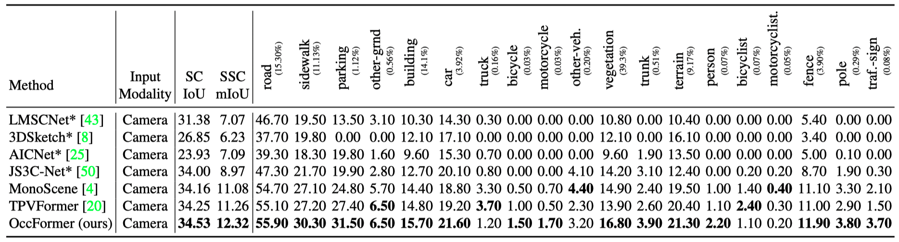

# OccFormer: Dual-path Transformer for Vision-based 3D Semantic Occupancy Prediction

## News

- **[2023/04/11]** Code and demo release.

## Demo

### nuScenes:

### SemanticKITTI:

## Benchmark Results
LiDAR Segmentation on nuScenes test set:

Semantic Scene Completion on SemanticKITTI test set:

## Introduction
The vision-based perception for autonomous driving has undergone a transformation from the bird-eye-view (BEV) representations to the 3D semantic occupancy. Compared with the BEV planes, the 3D semantic occupancy further provides structural information along the vertical direction. This paper presents OccFormer, a dual-path transformer network to effectively process the 3D volume for semantic occupancy prediction. OccFormer achieves a long-range, dynamic, and efficient encoding of the camera-generated 3D voxel features. It is obtained by decomposing the heavy 3D processing into the local and global transformer pathways along the horizontal plane. For the occupancy decoder, we adapt the vanilla Mask2Former for 3D semantic occupancy by proposing preserve-pooling and class-guided sampling, which notably mitigate the sparsity and class imbalance. Experimental results demonstrate that OccFormer significantly outperforms existing methods for semantic scene completion on SemanticKITTI dataset and for LiDAR semantic segmentation on nuScenes dataset.

## Getting Started

[1] Check [installation](docs/install.md) for installation. Our code is mainly based on mmdetection3d.

[2] Check [data_preparation](docs/prepare_dataset.md) for preparing SemanticKITTI and nuScenes datasets.

[3] Check [train_and_eval](docs/train_and_eval.md) for training and evaluation.

[4] Check [predict_and_visualize](docs/predict_and_visualize.md) for prediction and visualization.

[5] Check [test_submission](docs/test_submission.md) for preparing the test submission to [SemanticKITTI SSC](https://codalab.lisn.upsaclay.fr/competitions/7170) and [nuScenes LiDAR Segmentation](https://www.nuscenes.org/lidar-segmentation?externalData=all&mapData=all&modalities=Any).

## Model Zoo

We provide the pretrained weights on SemanticKITTI and nuScenes datasets, reproduced with the released codebase.

| Dataset | Backbone | SC IoU | SSC mIoU | LiDARSeg mIoU | Model Weights | Training Logs |
|:----:|:----:|:----:|:----:|:----:|:----:|:----:|
| [SemanticKITTI](projects/configs/occformer_kitti/occformer_kitti.py) | EfficientNetB7 | 36.42(val), 34.46(test) | 13.50(val), 12.37(test) | - | [Link](https://github.com/zhangyp15/OccFormer/releases/download/assets/occformer_kitti.pth) | [Link](https://github.com/zhangyp15/OccFormer/releases/download/assets/occformer_kitti.log)
| [nuScenes](projects/configs/occformer_nusc/occformer_nusc_r50_256x704.py) | R50 | - | - | 68.1 | [Link](https://github.com/zhangyp15/OccFormer/releases/download/assets/occformer_nusc_r50.pth) | [Link](https://github.com/zhangyp15/OccFormer/releases/download/assets/occformer_nusc_r50.log)
| [nuScenes](projects/configs/occformer_nusc/occformer_nusc_r101_896x1600.py) | R101-DCN | - | - | 70.4 | [TODO] | [TODO]

For SemanticKITTI dataset, the validation performance may fluctuate around 13.2 ~ 13.6 (SSC mIoU) considering the limited training samples. 

## Related Projects

[TPVFormer](https://github.com/wzzheng/TPVFormer): Tri-perspective view (TPV) representation for 3D semantic occupancy.

[OpenOccupancy](https://github.com/JeffWang987/OpenOccupancy): A large scale benchmark extending nuScenes for surrounding semantic occupancy perception.

## Acknowledgement

This project is developed based on the following open-sourced projects: [MonoScene](https://github.com/astra-vision/MonoScene), [BEVDet](https://github.com/HuangJunJie2017/BEVDet), [BEVFormer](https://github.com/fundamentalvision/BEVFormer), [Mask2Former](https://github.com/facebookresearch/Mask2Former). Thanks for their excellent work.
